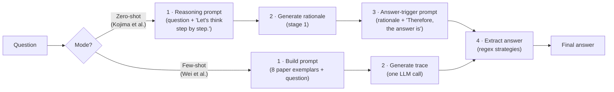

# chain-of-thought-agent

A runnable Python implementation of **Chain-of-Thought (CoT) prompting** — *"Chain-of-Thought Prompting Elicits Reasoning in Large Language Models"* (Wei et al., 2022, NeurIPS 2022, [arXiv:2201.11903](https://arxiv.org/abs/2201.11903)).

The paper's core idea is disarmingly simple: instead of asking a language model for an answer directly, **prompt it to reason step by step first**. CoT prompting — either with a few worked exemplars or with the zero-shot trigger *"Let's think step by step"* — lets large models decompose multi-step problems and dramatically improves accuracy on arithmetic, commonsense, and symbolic reasoning tasks (e.g. 8 CoT exemplars lift PaLM 540B to state-of-the-art on GSM8K math word problems).

This repo implements the full pipeline, running **100% offline** with a deterministic mock LLM (a real OpenAI-compatible backend is optional).

## Quickstart

```bash
pip install -r requirements.txt
python examples/run_demo.py   # no API key, no network
pytest -q                     # 45 tests
```

## How it works



**Example — few-shot CoT trace:**

```
Q: A baker made 36 cookies. Each bag holds 9 cookies, and she gave away 1 bag.
   How many bags of cookies does she still have?
A: There are 36 cookies in total. Each bag holds 9 cookies, so the number of
   bags is 36 / 9 = 4. She gave away 1 bag, so 4 - 1 = 3. The answer is 3.

extracted answer: 3
```

## Paper → code mapping

| Paper concept | Section | Implementation |
|---|---|---|
| Few-shot CoT exemplars (Q/A with worked reasoning, "The answer is N." convention) | Wei et al. §2.1, Table A1 (8 GSM8K exemplars) | `chain_of_thought/exemplars.py` → `PAPER_EXEMPLARS`, `ExemplarBank.select(n, strategy)` |
| Exemplars + target question formatted as `Q:`/`A:` blocks | Wei et al. §2.1 | `chain_of_thought/prompts.py` → `build_few_shot_prompt()` |
| Zero-shot CoT: single trigger phrase "Let's think step by step." | Kojima et al. 2022 ([arXiv:2205.11916](https://arxiv.org/abs/2205.11916)) | `chain_of_thought/prompts.py` → `build_zero_shot_prompt()` |
| Two-stage answer extraction via "Therefore, the answer is" | Kojima et al. §2 | `chain_of_thought/prompts.py` → `build_zero_shot_answer_prompt()` |
| Extracting the final answer from a free-form rationale | (downstream of the paper) | `chain_of_thought/extractor.py` → `extract_answer()` (`\boxed{}`, "therefore", "the answer is", "answer:", numeric fallback) |
| The whole CoT pipeline: prompt → generate → extract | Wei et al. §2 | `chain_of_thought/solver.py` → `CoTSolver.solve()` / `solve_batch()` |
| LLM access through one interface (offline mock + optional real model) | — | `chain_of_thought/backends.py` → `LLMBackend` protocol, `MockLLM`, `OpenAILLM` |

## Using a real model

The mock LLM (`chain_of_thought/backends.py` → `MockLLM`) returns canned CoT traces for the demo word problems — enough to exercise the whole pipeline offline. To run CoT on a real model instead, point `OpenAILLM` at any OpenAI-compatible endpoint (it uses only the stdlib; no SDK dependency):

```bash
export COT_BASE_URL="http://localhost:11434/v1"  # e.g. Ollama
export COT_API_KEY="ollama"
export COT_MODEL="llama3.1"
```

```python
from chain_of_thought import CoTSolver, OpenAILLM

few_shot  = CoTSolver(OpenAILLM(), mode=CoTSolver.FEW_SHOT, n_exemplars=8)
zero_shot = CoTSolver(OpenAILLM(), mode=CoTSolver.ZERO_SHOT)

q = "A baker made 36 cookies. Each bag holds 9 cookies, and she gave away 1 bag. How many bags of cookies does she still have?"
print(few_shot.solve(q).answer)   # trace + extracted answer
print(zero_shot.solve(q).answer)
```

## Project layout

```
chain_of_thought/
  exemplars.py   # the paper's 8 GSM8K few-shot CoT exemplars + ExemplarBank
  prompts.py     # few-shot prompt builder + zero-shot two-stage templates
  extractor.py   # answer extraction from a generated rationale
  solver.py      # CoTSolver: prompt → generate → extract (both modes)
  backends.py    # LLMBackend protocol, MockLLM (offline), OpenAILLM
examples/run_demo.py   # offline end-to-end demo (5 word problems × 2 modes)
tests/                 # pytest suite (45 tests)
```

## Limitations

- The mock LLM answers from canned traces, so its *answers* are a didactic stand-in; the value being demonstrated is the prompt-construction and answer-extraction machinery. Swap in `OpenAILLM` for genuine model behavior.
- `extract_answer` handles the standard CoT answer conventions; exotic formats may need another regex in `extractor.py`.
- Self-consistency (sample-and-vote over CoT paths, Wang et al. 2022) and Tree of Thoughts are deliberately out of scope — see the sibling `self-consistency` repo for the voting layer that builds on top of CoT.

## License

MIT — see [LICENSE](LICENSE).
